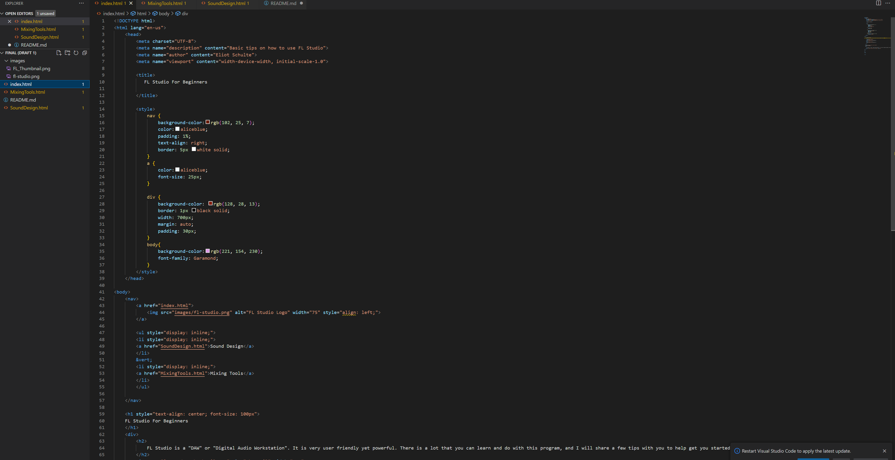

The goal of my website is to inform people of a program that I really enjoy! Someone might visit my website to get a quick and basic grasp on FL Studio if they are looking to start learning how to use it! 
Responsive web design is important because we all like things that work correctly. I know how frustrating it is working on an unresponsive computer or playing a game this isn't quite finished. Having a responsive website yields a higher chance for people to return and reccomend it to others! 
